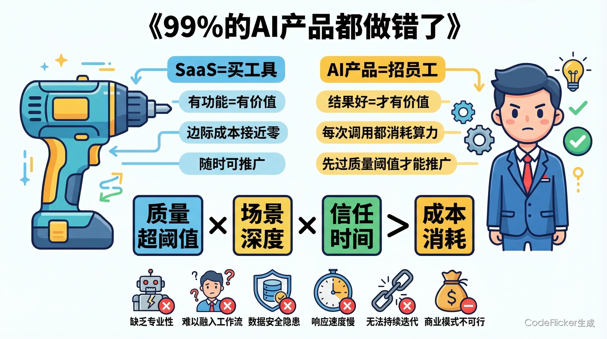
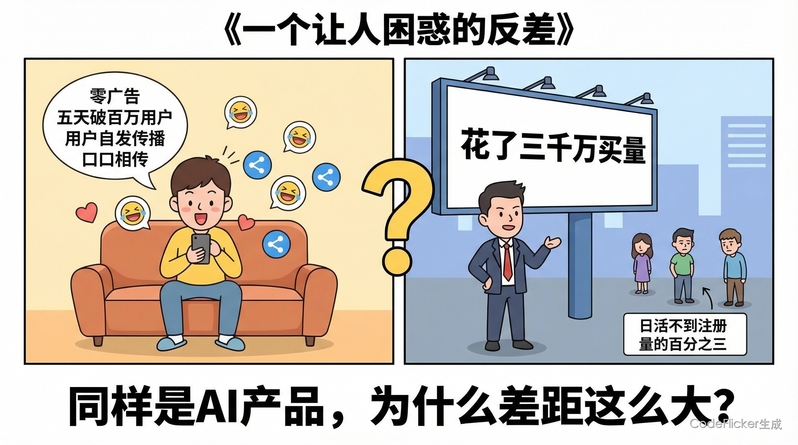
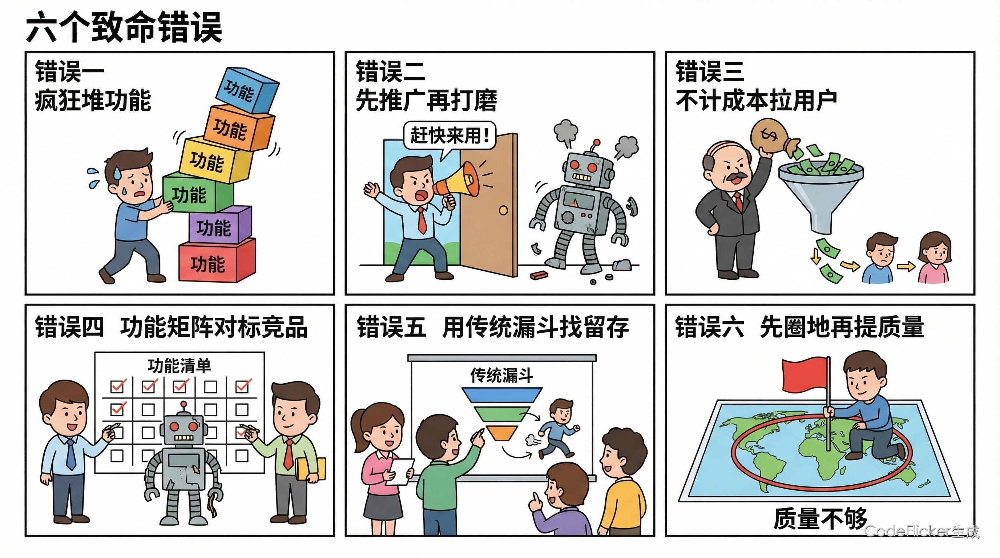
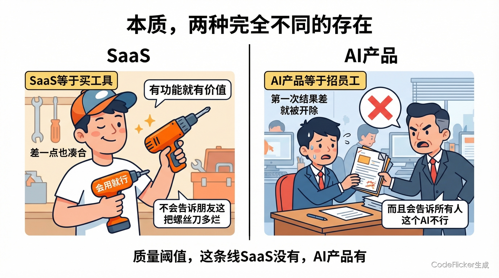
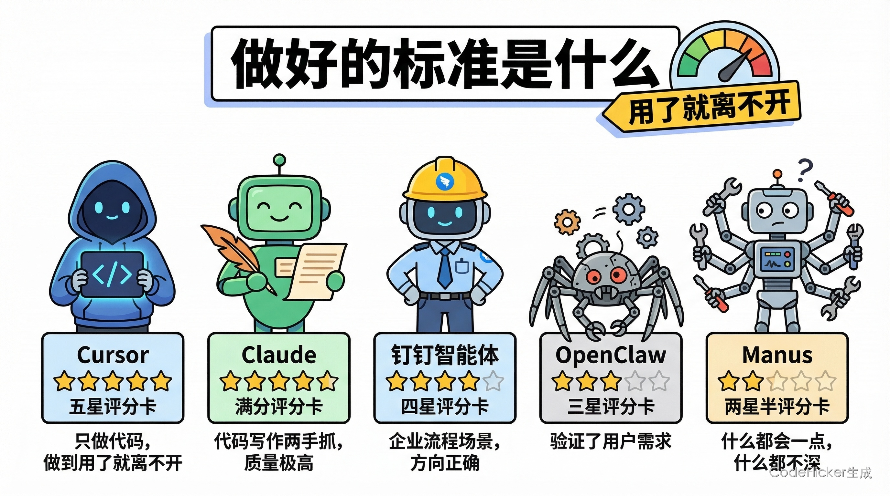
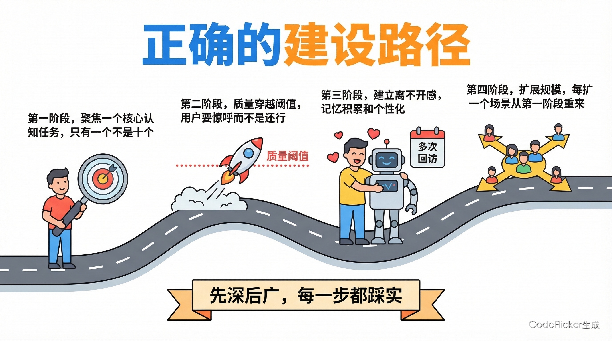
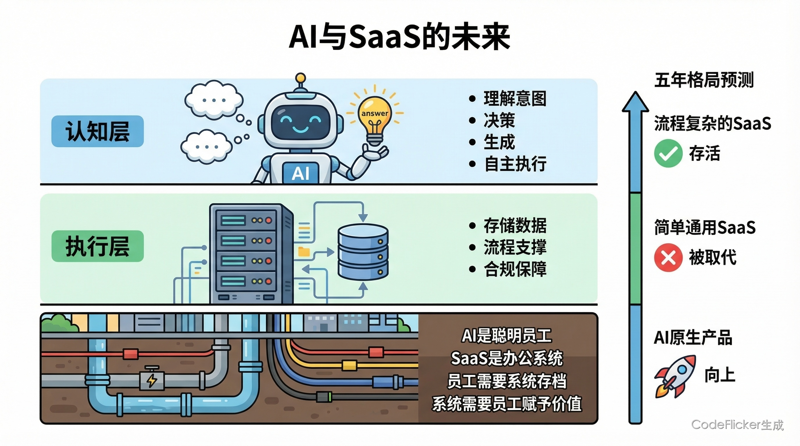
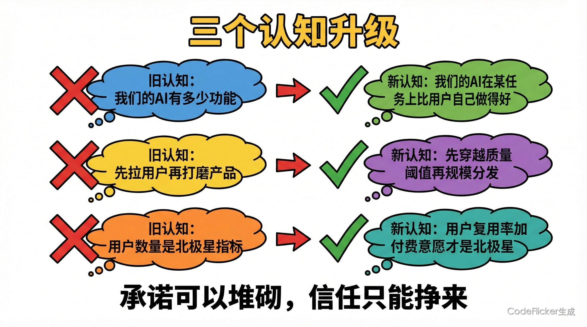
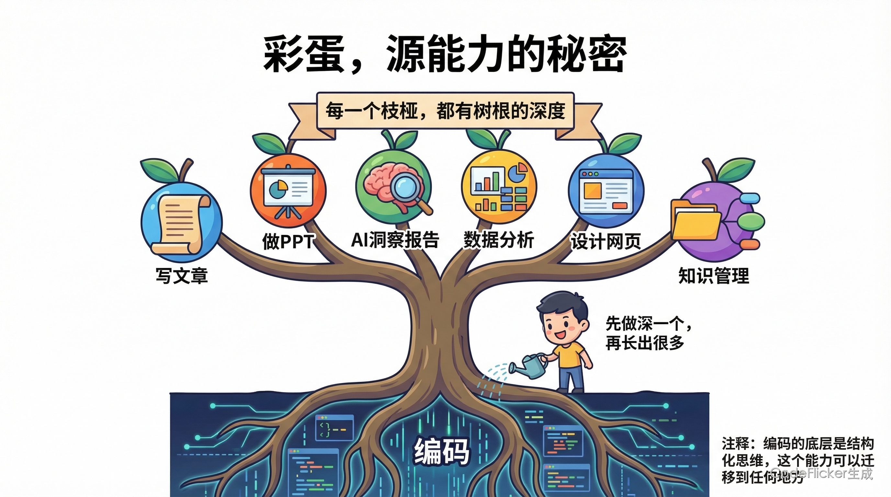

# 99%的AI产品都做错了

**他们在用"买工具"的思维，做"招员工"的事。**

---

# 00 全文概览

**核心结论：AI产品的本质是"认知代劳"，不是"功能替代"。用SaaS的逻辑做AI，越努力越错。**

| 维度 | SaaS（买工具） | AI产品（招员工） |
|------|-------------|--------------|
| **用户要什么** | 能用这个功能 | 帮我把这件事做好 |
| **价值评判** | 有功能 = 有价值 | 结果好 = 才有价值 |
| **失望后果** | 换个功能继续用 | 离开+告诉别人"AI没用" |
| **成本结构** | 边际成本趋近零 | 每次推理都烧算力 |
| **传播方式** | 渠道驱动（广告/KOL） | 口碑驱动（爽感自发分享） |
| **推广时机** | 任何时候都可以 | 必须穿越质量阈值后 |

📌 **成功公式：(Q > 阈值) × D × T > E** — 质量穿线是底线，场景要深不要广，信任积累必须跑赢成本消耗。

---

# 01 一个让人困惑的反差

2022年底，ChatGPT上线。没有发布会，没有广告，一条推文：
> "我们推出了ChatGPT，来试试吧。"

5天后，用户破百万。60天后，破亿。

同一时期，国内某AI产品花了数千万买量、签KOL。3个月后，日活不到注册用户的3%。

还有Cursor——没投过一条广告，Year 1年化$1亿，Year 2年化$20亿+。程序员们自发传播：**"用了就再也回不去了。"**

**为什么做得好的AI产品反而不推广？砸了很多钱的AI产品反而越做越难？**

答案只有一个：他们对AI产品本质的理解，从一开始就不一样。

---

# 02 六个国内AI产品正在犯的错误

**错误1：拼命堆功能**

发布会展示30个功能，每个都写着"首创"。

这个逻辑来自SaaS时代——功能多 = 价值多。但AI产品不同：**质量不够的功能越多，负面体验面越大。** 用了10个功能，9个"差不多还行"，1个彻底搞砸——这个用户走了，走之前告诉5个朋友"这个AI不行"。

**错误2：先推广再打磨**

"用户反馈来了再迭代，这叫敏捷。" SaaS可以，用户的反馈是"加功能""改交互"，可以修复。AI用户的反馈是：给了一个糟糕回答，犯了一个让人尴尬的错误——**第一印象定格为"AI没用"，几乎不可逆。**

**错误3：不计成本拉用户**

SaaS的免费用户几乎不消耗额外成本；AI的每一次推理都要算力。质量没过阈值，拉来的每个用户都在亏钱烧信誉。越努力推广，越加速负口碑传播。

**错误4：功能矩阵对标竞品**

勾出最长的功能✓✓✓。用户真正想问的是：**"你的答案，我能直接用吗？"** AI的竞争维度是质量深度，不是功能广度。

**错误5：用SaaS漏斗找留存答案**

留存低 → 疯狂优化Onboarding → 半年后留存还是低。
问题不在漏斗，在质量。SaaS的留存是UX问题，AI的留存是质量问题，答非所问。

**错误6：先圈地盘再提质量**

"先占住这个场景，之后再提质量。" AI的用户心智是"这个AI够不够聪明"。**圈了一个"不够聪明"的心智，是最难逆转的。**

---

以上六个错误，背后只有一个根因：**用买工具的逻辑，做招员工的事。**

---

# 03 本质：两种完全不同的存在

### 用一个比喻把本质说清楚

> **SaaS = 买了一台电动工具**
>
> **AI产品 = 招了一名员工**

买了电动工具，能打钉就有价值——打得不够漂亮你也会凑合用，而且你不会跟朋友说"这把螺丝刀太烂了"。

招了一名员工，她第一次帮你整理资料整得乱七八糟——你不会说"好的，她有整理能力，我继续等她进步"，你会直接辞了，而且你会告诉周围人"这个人靠不住"。

**这个比喻，解释了AI产品所有的本质差异：**

| 维度 | 电动工具（SaaS） | 员工（AI产品） |
|------|---------------|-------------|
| 如何评价 | 有功能 = 有价值 | 结果好 = 才有价值 |
| 第一印象 | 差也还会用 | 差就直接走 |
| 口碑传播 | 不会特意推荐 | 好的强烈安利，差的主动劝退 |
| 成本结构 | 买了一次就好 | 每天都在消耗（算力）|
| 成长性 | 买了是固定功能 | 越用越懂你 |

### 最关键的一点：质量阈值

AI产品有一条"质量阈值线"，是用户"宁可自己做，也不用AI"的临界点。

| 状态 | 路径 |
|------|------|
| **低于阈值** | 试用 → "不如自己来" → 不再用 → 告诉朋友"AI没用" |
| **高于阈值** | 试用 → "比我自己做得好！" → 形成习惯 → 告诉朋友"你一定要试" |

SaaS没有这条线——有功能就有价值。AI有这条线，低于阈值时任何推广都是在加速负口碑传播。

---

# 04 做好的标准是什么

一套五维评估框架，用来看一个AI产品是否真的做对了：

| 维度 | 最高标准 | 公式变量 |
|------|---------|--------|
| **价值密度 Q** | 用完有"省了自己脑力"的清晰感知，不是"差不多凑合" | Q 质量 |
| **成本收支 E** | Day 1就有用户付费，不靠免费补贴维持使用 | E 经济性 |
| **信任护城河 T** | 用户主动推荐，且有个性化记忆积累带来的迁移成本 | T 信任 |
| **场景聚焦 D** | 先把1个核心场景打透，而非广铺功能 | D 深度 |
| **安全可控 T** | 用户能理解AI做了什么，能审查，能回滚 | T 信任基础 |

### 用这套标准看五款产品

| 产品 | Q 价值密度 | E 成本收支 | T 信任护城河 | D 场景聚焦 | 结论 |
|-----|:--------:|:--------:|:----------:|:--------:|:---:|
| **Cursor** | ★★★★★ | ★★★★★ | ★★★★★ | ★★★★★ | ✅ 教科书 |
| **Claude Code** | ★★★★★ | ★★★★ | ★★★★ | ★★★★★ | ✅ 教科书 |
| **钉钉悟空** | ★★★★ | ★★★★ | ★★★★★ | ★★★★ | ✅ 方向正确 |
| **OpenClaw** | ★★★★ | ★★ | ★★★ | ★★★ | ⚠️ 验证了需求 |
| **Manus** | ★★★ | ★★ | ★★ | ★★ | ⚠️ 通用陷阱 |

**Cursor/Claude Code：为什么是教科书**

只做代码这一件事，把AI帮助做到"用了就离不开"。零广告，靠程序员圈子自发传播。Cursor Year 1年化$1亿，Year 2年化$20亿+；Claude Code年化$5亿，Anthropic内部80%以上工程师日常使用。

两者最重要的共同点：**Day 1就收费，没有免费期。** 不是激进，是清醒。好员工不需要通过免费试用来证明自己的价值。

**Manus：通用陷阱**

什么都能做——搜索、写报告、写代码……正因为"什么都做"，掉进了最典型的陷阱：**样样能做，样样不深**。Coding有Cursor更好，Research有Perplexity更好，写作有Claude更好……没有一个场景做到"用了就离不开"。

在员工市场，"什么都会一点"的员工，远不如"某方面极其出色"的员工更受信任。

---

# 05 正确的建设路径

### 先找到"认知任务"

不要问"我的AI能做什么功能"，要问"我替用户完成哪个脑力工作"。

好的认知任务：用户做这件事**很耗脑力** + AI做的质量**超越用户自己** + 场景**足够高频**。

只找一个，不是十个。

### 四阶段建设路径

| 阶段 | 动作 | 关键原则 |
|------|------|--------|
| 阶段一 | 聚焦一个核心认知任务 | 只有一个，不是十个 |
| 阶段二 | 质量穿越阈值 | 用户要"惊呼"，不是"还行" |
| 阶段三 | 建立"离不开感" | 记忆积累 + 个性化 + 高迁移成本 |
| 阶段四 | 扩展场景和用户规模 | 每扩一个场景，都从阶段一重来 |

### 为什么Day 1就要收费

| 理由 | 说明 |
|------|------|
| **边际成本为正** | 每个用户每次用都烧算力，不收费就在亏钱 |
| **付费筛选优质反馈** | 付费用户的反馈精准，帮产品更快穿越阈值 |
| **锚点不可逆** | 先做免费，锚点定格为零，之后转收费极难 |

Cursor验证：直接$20/月，Year 1破$1亿ARR。不是冒险，是清醒——**顶级员工不需要免费试用期**。

### 推广时机三问

三个都是YES，才是推广的时机：

1. 用了之后，会主动**复用**吗？（质量穿越阈值了吗）
2. 用了之后，会**推荐给朋友**吗？（爽感够强了吗）
3. 每个用户的 LTV > CAC + 算力成本吗？（商业逻辑自洽了吗）

---

# 06 AI与SaaS的未来

AI崛起，SaaS会消亡吗？不会。但会被重构。

未来的分工：

| 角色 | 负责 |
|------|------|
| **AI** | 认知层：理解意图、决策、生成、自主执行 |
| **SaaS** | 执行层：存储数据、流程支撑、合规保障 |

用员工类比：AI是那个聪明能干的员工，SaaS是公司的OA系统和数据库——员工需要系统来存档走流程，系统需要员工来赋予它价值。

**5年内的格局判断：**

| 类型 | 判断 |
|------|------|
| 流程复杂、数据深的SaaS（ERP/CRM） | ✅ 进化为AI执行基础设施，存活 |
| 流程简单的通用SaaS（文档/轻量协作） | ❌ 被AI整合或替代 |
| 从Agent出发的AI原生产品 | ✅ 构建新物种，攻克存量市场 |

---

# 07 结论

**三个思维转换，是AI产品建设者最需要的认知升级：**

| 从 | 到 |
|---|---|
| "我们的AI有XX功能" | "我们的AI在XX任务上比用户自己做得好" |
| "先拉用户再打磨" | "先穿越阈值，再规模分发" |
| "用户量是北极星" | "用户复用率 + 付费意愿才是北极星" |

> ### 承诺可以堆砌，信任只能挣来。

---

**━━━━━━━━━━━━━━━━━━━━━━━━━━━━━━━**
📌 **养了个AI · 专栏导航**

✅ 第0期｜预告：它每天6点自己醒来，帮我干完半天的活
✅ 第1期｜当你停止把AI当工具，一切都变了
✅ 第2期｜第一步：让你的AI记住你是谁
✅ 第3期｜第二步：教它学会第一个技能
✅ 第4期｜实战：从辅导到评审，AI帮我扛过了整个晋升季
✅ 第5期｜实战：我说了句"帮我盯着AI行业"，它自己造了个情报站
👉 **深度洞察｜99%的AI产品都做错了** ← 你在这里

**━━━━━━━━━━━━━━━━━━━━━━━━━━━━━━━**

---

# 08 彩蛋

这篇文章整合了几个月来的深度调研结论：OpenClaw爆红背后的产品逻辑、钉钉悟空的企业级解法、AI Coding产品的全景对比。

写完之后，我意识到一件有意思的事——写这篇文章的工具本身，其实就是这套逻辑最好的注脚。

**CF 是怎么做的？**

它起步于一个极其聚焦的场景：**编码**。

不是"辅助编程"，不是"写写代码"——而是把编码这件事做到极致：理解上下文、生成可运行的代码、调试报错、重构逻辑……直到工程师用了之后说出那句话：**"这个工具，我离不开了。"**

做到这一步，才开始往外延展。

但有意思的地方来了：**编码不只是一个功能，它是一种源能力。**

能写代码，就能写 Markdown 文章；能写文章，就能生成 PPT；能生成 PPT，就能做数据洞察报告；能做报告，就能做 AI 行业追踪……代码是底层逻辑——严谨、结构化、可复现。把这套思维复制到每一个新领域，每一个广度方向上都不是蜻蜓点水，而是带着同样深度的逻辑进去——

> **先做深度，再做广度。让每一个广度，都有深度。**

这条路比"什么都做一点"难得多，也壁垒高得多。

Manus 是反例：什么都能做，什么都不深。没有任何一个场景让用户说"用了就离不开"。

CF 的路是另一条：从编码的极致出发，用同一套深度思维去撬动更大的领域。**不是横向复制功能，而是纵向复制标准。**

某种意义上，它就是这套理论的自我实证：先在一个地方挣到信任，再把这份信任延伸到更多地方。

📌 **让人停下来说"你一定要用这个"的那一刻，就是AI产品成功的信号。**

> 那个瞬间，不能买来，只能挣来。
