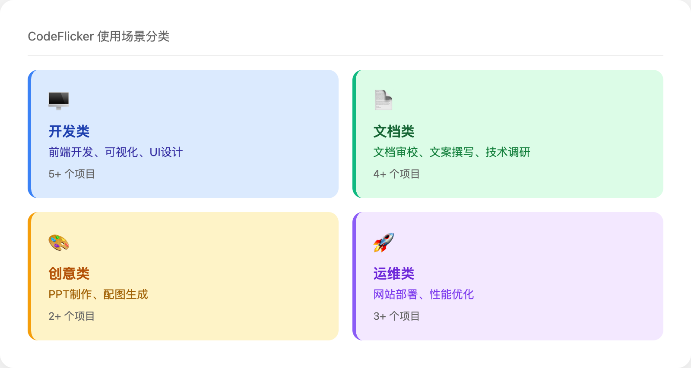
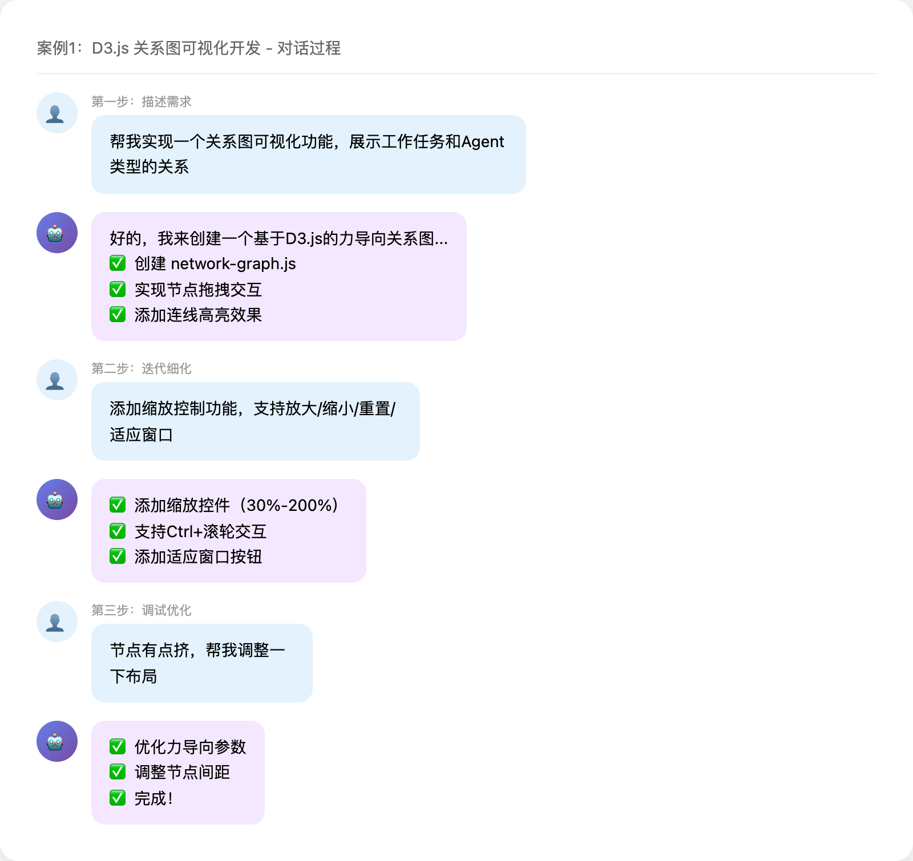
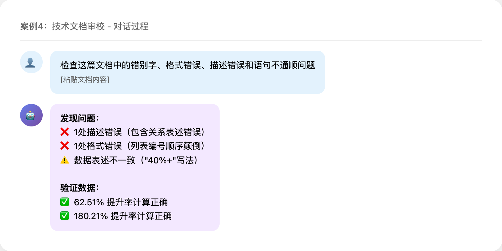
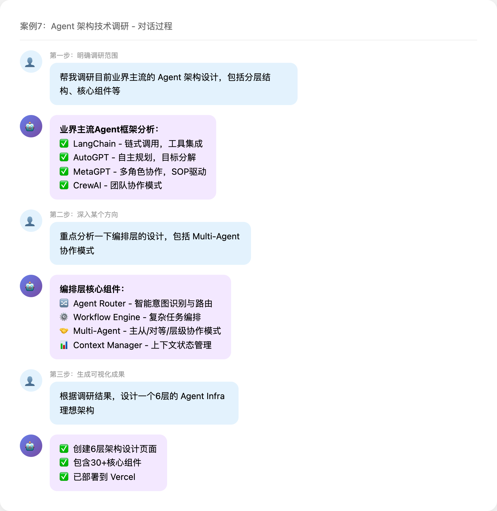
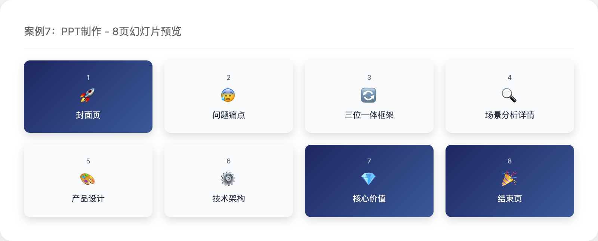
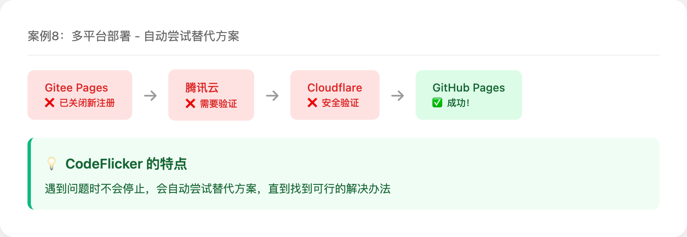
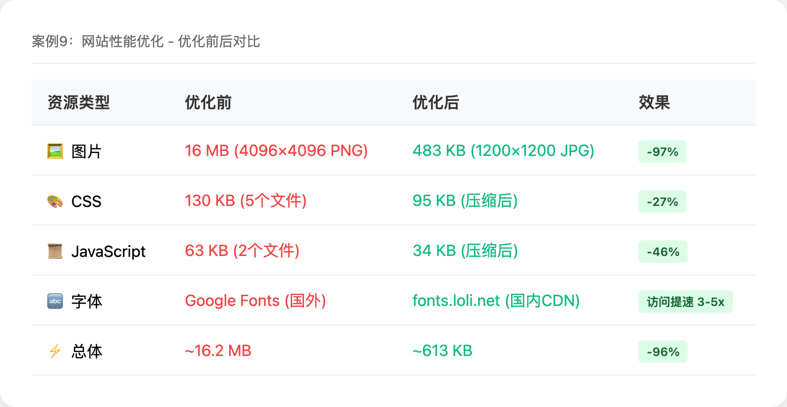
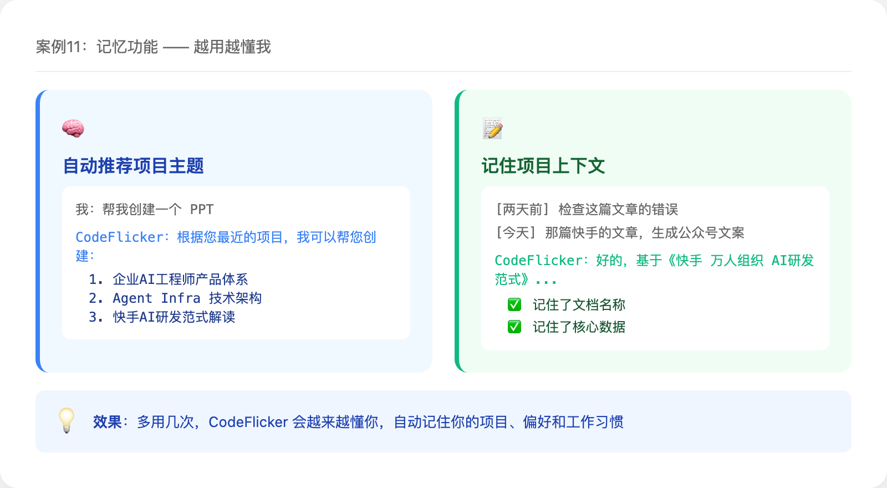
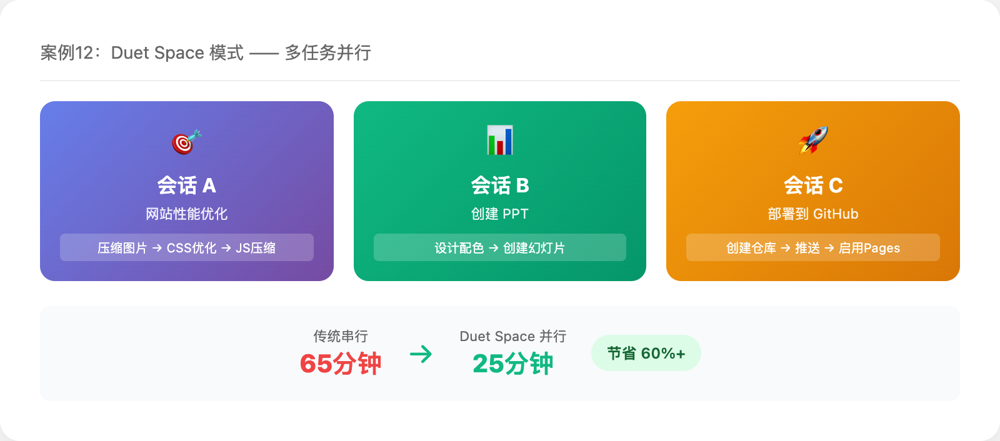
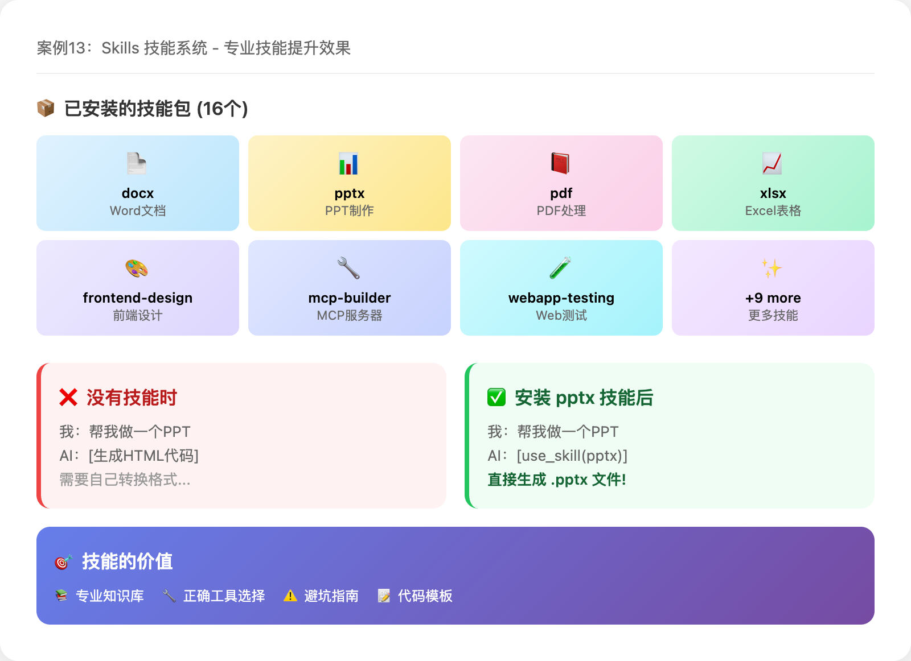

# 🔥 一周体验：我用 CodeFlicker 写代码、做PPT、搞调研、发部署，差点以为自己有了助理

> 很多同学可能还停留在"CodeFlicker = AI编程助手"的认知上。今天我想分享一下过去几周的真实体验：**CodeFlicker 远不止写代码，它帮我完成了产品设计、PPT制作、文档审校、网站部署等各种任务**，体验下来真的有点像 Manus —— 一个能帮你做各种事情的 AI 助手。

## 📊 我用 CodeFlicker 做过的事情分类



| 类别 | 具体场景 | 项目数量 |
|------|---------|---------|
| 🖥️ **开发类** | 前端开发、可视化、UI设计 | 5+ |
| 📄 **文档类** | 文档审校、文案撰写、技术调研 | 5+ |
| 🎨 **创意类** | PPT制作、配图生成 | 2+ |
| 🚀 **运维类** | 网站部署、性能优化 | 3+ |
| 🧠 **产品能力** | 记忆功能、多任务并行、技能系统 | 3 |

下面我会按类别分享具体案例，每个案例都会详细说明**我是怎么用 CodeFlicker 一步步完成的**，希望能给大家一些参考。

---

## 🖥️ 开发类场景

### 案例1：D3.js 关系图可视化开发

**背景**：我需要为一个企业AI工程师分析项目创建一个交互式关系图，展示48个工作任务和9种Agent类型之间的关系。

**我是这样做的**：



```
第一步：描述需求
我：帮我实现一个关系图可视化功能，展示工作任务和Agent类型的关系

第二步：迭代细化
我：添加缩放控制功能，支持放大/缩小/重置/适应窗口
我：缩放范围设置为30%-200%，支持Ctrl+滚轮交互

第三步：调试优化
我：节点有点挤，帮我调整一下布局
我：鼠标hover的时候高亮相关连线
```

**CodeFlicker 做了什么**：
1. 自动创建了 `network-graph.js`，使用 D3.js 实现力导向图
2. 添加了完整的缩放控件和交互逻辑
3. 实现了节点拖拽、连线高亮等交互效果
4. 自动适配了项目的CSS风格

**最终效果**：一个完整的可交互关系图，支持缩放、拖拽、高亮等功能。

*实际效果可访问：https://ai-engineer-analysis.vercel.app/1-ai-engineer-analysis/*

> 💡 **学习要点**：不需要一次性描述清楚所有需求，可以先给大方向，然后逐步迭代细化。

---

### 案例2：9种 Agent 类型详情页开发

**背景**：需要为9种Agent类型（Coding、Chatbot、Workflow等）各创建一个详细介绍页面。

**我是这样做的**：

```
我：为9种Agent类型创建详细的介绍页面，包含技术特点、实现原理、应用场景和产品案例
```

就这一句话。

**CodeFlicker 做了什么**：
1. 创建了 `agent-details.html` 和 `agent-details.css`
2. 为每种Agent设计了统一的卡片模板
3. 填充了技术架构图、关键技术点、国内外产品案例
4. 自动修改了首页，添加了跳转链接
5. 测试了完整功能流程

**最终效果**：9个Agent都有了完整的详情页，包含技术实现、核心栈和应用案例。

> 💡 **学习要点**：如果任务比较明确，可以一次性描述清楚，让 CodeFlicker 一次性完成。

---

### 案例3：多项目 UI 风格统一

**背景**：项目有3个子模块，UI风格不统一，需要进行统一并做紧凑化设计。

**我是这样做的**：

```
我：将3个项目的UI设计风格进行统一并实现紧凑化布局
```

**CodeFlicker 做了什么**：
1. 分析了3个项目的现有样式
2. 创建了共享样式文件 `shared/base.css`
3. 对每个项目进行了紧凑化调整：
   - Header padding: 48px → 32px
   - 标题字号: 2.2rem → 1.8rem
   - 卡片间距优化
4. 确保3个项目风格完全一致

> 💡 **学习要点**：涉及多个文件的批量修改，CodeFlicker 会自动处理依赖关系。

---

## 📄 文档类场景

### 案例4：技术文档审校

**背景**：有一篇内部文档《万人组织 AI研发范式 跃迁之路》，需要检查错别字、格式错误和数据描述问题。

**我是这样做的**：



```
我：检查这篇文档中的错别字、格式错误、描述错误和语句不通顺问题
[粘贴文档内容]
```

**CodeFlicker 做了什么**：
1. 逐段扫描文档内容
2. 发现并标注了：
   - 1处描述错误（智能化2.0实践包含关系表述错误）
   - 1处格式错误（列表编号顺序颠倒）
   - 数据表述不一致问题（如"40%+"写法不统一）
3. 验证了核心数据计算是否正确（如62.51%和180.21%的提升率）
4. 给出了具体的修改建议

**最终效果**：发现了2处明确问题，并给出了修正建议。

> 💡 **学习要点**：CodeFlicker 不仅能找错别字，还能验证数据计算、检查逻辑一致性。

---

### 案例5：公众号文案生成

**背景**：需要将一篇内部技术文章转化为吸引人的公众号导览文案。

**我是这样做的**：

```
我：将这篇文章转化为公众号导览文案，突出官方权威性和实践价值
```

**CodeFlicker 做了什么**：
1. 提取了文章的核心洞察（"工具≠提效"）
2. 生成了3个不同风格的版本：
   - 版本A：简洁标题版
   - 版本B：结构化要点版
   - 版本C：深度导读版
3. 每个版本都突出了关键数据（代码生成率提升180%，交付周期缩短53%）

**最终效果**：3个版本供选择，直接可用于公众号发布。

> 💡 **学习要点**：可以要求 CodeFlicker 生成多个版本供选择。

---

### 案例6：特定风格的技术文章撰写

**背景**：需要按照某公众号的写作风格，撰写一篇技术解读文章。

**我是这样做的**：

```
第一步：让 CodeFlicker 研究目标风格
我：分析一下"思码逸"公众号的写作风格特点

第二步：按风格撰写
我：按照这个风格，撰写一篇解读快手AI研发实践的文章

第三步：调整视角
我：调整为媒体旁观者视角，而不是当事人视角
```

**CodeFlicker 做了什么**：
1. 研究了目标公众号的写作风格（数据驱动、问题引导型标题等）
2. 按照该风格撰写了初稿
3. 根据反馈调整了文章视角和结构

**最终效果**：一篇符合目标风格的技术解读文章。

> 💡 **学习要点**：可以让 CodeFlicker 先学习目标风格，再按风格创作。

---

### 案例7：Agent 架构技术调研

**背景**：需要研究业界主流的 Agent 架构设计，为公司的 AI 平台提供技术参考。

**我是这样做的**：

```
第一步：明确调研范围
我：帮我调研目前业界主流的 Agent 架构设计，包括分层结构、核心组件等

第二步：深入某个方向
我：重点分析一下编排层的设计，包括 Multi-Agent 协作模式

第三步：生成可视化架构图
我：根据调研结果，设计一个6层的 Agent Infra 理想架构
```

**CodeFlicker 做了什么**：
1. 搜索并分析了业界主流 Agent 框架（LangChain、AutoGPT、MetaGPT 等）
2. 总结了6层架构分层设计：
   - **产品层**：IDE、Web、IM、CLI 等产品触点
   - **应用层**：Coding Agent、Chatbot Agent 等具体应用
   - **编排层**：Agent Router、Workflow Engine、Multi-Agent 协作
   - **实现层**：统一 Agent SDK、Prompt 工程
   - **能力层**：工具、记忆、知识、推理等核心能力
   - **基础设施层**：安全、可观测性、模型网关
3. 生成了完整的架构图页面（30+ 核心组件）
4. 对比了不同架构方案的优缺点

**最终效果**：
- 一个完整的 Agent Infra 架构设计页面
- 可访问：https://ai-engineer-analysis.vercel.app/3-agent-infra/



> 💡 **学习要点**：调研类任务可以分步骤进行，先广度后深度，最后生成可交付的成果。

---

## 🎨 创意类场景

### 案例8：专业 PPT 制作

**背景**：需要创建一个"企业AI工程师产品体系"的演示文稿。

**我是这样做的**：

```
我：帮我创建一个 PPT
CodeFlicker：您想创建什么主题的 PPT？
我：第一个（企业AI工程师产品体系）
```

**CodeFlicker 做了什么**：
1. 分析了项目内容，提取核心信息
2. 设计了配色方案（Midnight Executive 深海军蓝主题）
3. 创建了8页幻灯片：



4. 使用 pptxgenjs 生成了真正的 .pptx 文件

**最终效果**：221KB 的专业演示文稿，可以直接用于汇报。

> 💡 **学习要点**：CodeFlicker 可以直接生成 .pptx 文件，不只是给你代码。

---

## 🚀 运维类场景

### 案例9：多平台网站部署

**背景**：需要将项目部署到多个平台，确保国内用户可以访问。

**我是这样做的**：

```
我：项目能否在中国国内完成部署，让别人不登录VPN也能访问？
CodeFlicker：[给出了多种方案对比]

我：用首选方案帮我做一下部署
```

**CodeFlicker 做了什么**：



1. 分析了项目结构（纯静态 HTML/CSS/JS）
2. 评估了各种部署方案的优缺点
3. 依次尝试了多个平台：
   - Gitee Pages（发现已关闭新用户注册）
   - 腾讯云 Serverless（需要账号验证）
   - Cloudflare Pages（遇到安全验证）
   - **GitHub Pages**（成功！）
4. 创建了 GitHub 仓库，推送代码，启用 Pages
5. 同时保持 Vercel 部署

**最终效果**：
- Vercel: https://ai-engineer-analysis.vercel.app ✅
- GitHub Pages: https://shenlang20230619-max.github.io/ai-studio-projects/ ✅
- Gitee 仓库: https://gitee.com/shenlang2025/ai-studio-projects ✅

> 💡 **学习要点**：遇到问题时，CodeFlicker 会自动尝试替代方案。

---

### 案例10：网站性能优化

**背景**：部署后发现网站访问比较慢，需要优化性能。

**我是这样做的**：

```
我：页面访问比较卡顿，能否提升一下页面加载和访问性能？
```

**CodeFlicker 做了什么**：

**第一轮优化**：
1. 发现了一张 16MB 的图片，压缩到 483KB（减少 97%）
2. 替换 Google Fonts 为国内 CDN（fonts.loli.net）
3. 添加图片懒加载
4. CSS 压缩（减少 27%）

**第二轮优化**（我说"请进行进一步的优化"）：
1. JS 压缩（减少 46%）
2. 关键 CSS 内联（消除渲染阻塞）
3. 添加缓存控制头（静态资源1年缓存）
4. 延迟加载非关键 JS

**最终效果**：



> 💡 **学习要点**：可以多轮迭代，每次说"继续优化"就会进一步深入。

---

## 🧠 产品能力场景

### 案例11：记忆功能 —— 越用越懂我

**背景**：用了一段时间后，我发现 CodeFlicker 真的"记住"了我。



**真实体验1：自动推荐项目主题**

```
我：帮我创建一个 PPT
CodeFlicker：根据您最近的项目，我可以帮您创建以下主题的PPT：
  1. 企业AI工程师产品体系（AI Studio）
  2. Agent Infra 技术架构设计
  3. 快手AI研发范式解读
  4. ...
  
请问您想选择哪个？
我：第一个吧
```

**它是怎么知道的？** 因为它记住了我之前做过的所有项目，包括：
- AI Studio 产品体系设计（48个任务、9种Agent）
- Agent Infra 6层架构设计
- 快手AI研发范式文档处理

**真实体验2：记住项目上下文**

```
我：这篇文章帮我检查一下错误
CodeFlicker：[检查完毕，发现2处问题]

【两天后，新会话】
我：之前那篇快手的文章，帮我生成一个公众号导览文案
CodeFlicker：好的，基于之前审校过的《快手 万人组织 AI研发范式 跃迁之路》，
            我来生成公众号文案，重点突出核心数据（代码生成率提升180%，交付周期缩短53%）...
```

**它记住了什么？**
- 我审校过快手的文档
- 文档的核心数据和关键洞察
- 我关注的重点方向

**真实体验3：记住我的偏好**

多次项目后，CodeFlicker 会：
- 自动使用我常用的技术栈（D3.js、React）
- 遵循我的代码风格（命名规范、注释习惯）
- 按我喜欢的方式组织文件结构

> 💡 **学习要点**：多用几次，CodeFlicker 会越来越懂你，效率越来越高。

---

### 案例12：Duet Space 模式 —— 多任务并行，我就等着就行

**背景**：有一次我需要同时完成多项任务，但时间很紧。



**场景还原**：

```
任务1：网站性能优化（预计30分钟）
任务2：创建PPT（预计20分钟）
任务3：部署到GitHub Pages（预计15分钟）
```

**传统方式**：串行执行，总共65分钟

**Duet Space 模式**：

```
我开了3个会话窗口：

会话A：帮我优化网站性能，压缩图片和CSS/JS
  → CodeFlicker 开始分析、压缩、测试...

会话B：帮我创建一个企业AI产品体系的PPT
  → CodeFlicker 开始设计配色、创建幻灯片...

会话C：帮我部署到GitHub Pages
  → CodeFlicker 创建仓库、推送代码、启用Pages...
```

**实际效果**：
- 3个任务**同时进行**，互不干扰
- 每个会话有独立的上下文，不会混淆
- 我只需要偶尔看一眼进度，处理一下需要确认的操作
- **总耗时约25分钟**，节省60%以上时间

**适合的场景**：
- 🔄 一边跑测试，一边写文档
- 🔄 一边部署环境，一边做代码Review
- 🔄 一边调研技术方案，一边写演示Demo
- 🔄 一边优化性能，一边准备汇报材料

> 💡 **学习要点**：复杂任务拆分成多个会话并行执行，像有多个助理同时帮你干活。

---

### 案例13：Skills 技能系统 —— 让 AI 掌握专业技能

**背景**：CodeFlicker 有一个强大的 Skills 技能系统，可以安装各种专业技能包，让 AI 在特定领域表现得更专业。



**我安装的技能包**：

```
我在 ~/.codeflicker/skills/ 目录下安装了 16 个技能包：

📦 文档处理类
├── docx          - Word文档生成和编辑
├── pptx          - PPT演示文稿制作
├── pdf           - PDF文件处理
└── xlsx          - Excel表格操作

📦 开发辅助类
├── mcp-builder   - MCP服务器构建
├── webapp-testing - Web应用测试
└── skill-creator - 技能创建器

📦 创意设计类
├── frontend-design    - 前端UI设计
├── canvas-design      - 画布设计
├── algorithmic-art    - 算法艺术
└── web-artifacts-builder - Web组件构建

📦 专业领域类
├── internal-comms     - 内部沟通文案
├── doc-coauthoring    - 文档协作
├── brand-guidelines   - 品牌规范
└── theme-factory      - 主题工厂
```

**真实体验1：专业 PPT 制作**

没有安装 pptx 技能前：
```
我：帮我做一个PPT
CodeFlicker：[生成了一些HTML幻灯片代码]
```

安装 pptx 技能后：
```
我：帮我做一个PPT
CodeFlicker：[调用 use_skill(pptx)]
            [读取 pptxgenjs 专业指南]
            [生成了真正的 .pptx 文件，221KB]
```

**真实体验2：Word 文档生成**

这篇文章需要转成 Word 格式时：
```
我：帮我生成一个doc
CodeFlicker：[调用 use_skill(docx)]
            好的，我来使用 docx-js 生成专业的 Word 文档。
            [生成了包含9张配图的 .docx 文件，1.2MB]
```

技能让 CodeFlicker 知道：
- 使用哪个库（docx-js）
- 如何设置页面大小（US Letter 12240 x 15840 DXA）
- 如何正确插入图片（需要 type 参数）
- 如何创建表格（双宽度设置技巧）

**真实体验3：专业前端设计**

```
我：帮我设计一个架构图页面
CodeFlicker：[调用 use_skill(frontend-design)]
            [应用专业设计原则：渐变色、阴影、动画]
            [生成了高质量的可视化页面]
```

**如何安装技能**：

```bash
# 技能目录
~/.codeflicker/skills/

# 每个技能包含
├── SKILL.md      # 入口文件（核心指南）
├── scripts/      # 辅助脚本
└── templates/    # 模板文件
```

**技能的价值**：
- 🎯 **专业知识**：每个技能包含该领域的最佳实践
- 🔧 **正确工具**：知道用什么库、什么API
- ⚠️ **避坑指南**：避免常见错误（如 docx-js 的各种坑）
- 📝 **模板参考**：提供可复用的代码模板

> 💡 **学习要点**：安装专业技能包，让 CodeFlicker 在特定领域表现得像专家一样专业。

---

## 🎓 总结：如何用好 CodeFlicker

### 1️⃣ 不要局限于"写代码"

CodeFlicker 能做的事情远超编码：
- ✅ 写代码、调试、重构
- ✅ 创建 PPT、文档、配图
- ✅ 审校文章、生成文案
- ✅ 部署网站、优化性能
- ✅ 技术调研、方案分析

### 2️⃣ 学会"渐进式交互"

```
错误示范：一次性描述所有细节，写一大段
正确示范：先给大方向，然后逐步迭代
```

### 3️⃣ 遇到问题不要放弃

CodeFlicker 会自动尝试替代方案。比如我部署时：
- Gitee Pages 不可用 → 自动尝试腾讯云
- 腾讯云需要验证 → 自动切换到 GitHub Pages
- 最终成功部署

### 4️⃣ 善用"继续"和"进一步"

当你觉得结果还不够好时，直接说：
- "继续优化"
- "进一步完善"
- "还有什么可以改进的"

CodeFlicker 会继续深入。

### 5️⃣ 让它学习特定风格

```
我：分析一下"某某公众号"的写作风格
我：按照这个风格写一篇文章
```

---

## 🚀 最后

这篇文章本身，也是用 CodeFlicker 帮我写的 😄

我只给了它一个主题和大致方向：
> "写一篇文章，面向公司内所有研发同学介绍CodeFlicker，主题是'不只是编码'..."

然后它：
1. 分析了我过去的所有项目记录
2. 按类型进行了分类
3. 每个类型选取了典型案例
4. 详细描述了操作步骤
5. 总结了使用技巧

**这就是 CodeFlicker 的能力 —— 不只是编码，更是你的 AI 工作伙伴。**

---

## 🎁 立即体验

心动不如行动，以下是获取 CodeFlicker 的方式：

### 📥 下载安装

| 平台 | 下载链接 |
|------|---------|
| 🍎 **macOS** | [点击下载](https://www.codeflicker.ai/download) |
| 🪟 **Windows** | [点击下载](https://www.codeflicker.ai/download) |
| 🐧 **Linux** | [点击下载](https://www.codeflicker.ai/download) |

**官网**：[https://www.codeflicker.ai](https://www.codeflicker.ai)

### 📚 学习资源

- 📖 **中文教程**：[W3Cschool CodeFlicker 教程](https://www.w3cschool.cn/codeflickerdocs)
- 🎬 **视频教程**：官网首页有演示视频
- 💬 **使用交流**：可以在公司内部群交流使用心得

### 💡 快速上手建议

1. **下载安装** → 打开你的项目
2. **按 `Cmd/Ctrl + L`** → 唤起 AI 对话框
3. **说出你的需求** → 比如"帮我优化这段代码"
4. **体验一次完整的协作** → 感受它的能力

> 🔥 **友情提示**：第一次用可能会觉得"这也能做？"，多尝试几次，你会发现它能做的远超你的想象！

---

*如果你也有类似的体验，欢迎在评论区分享！*
