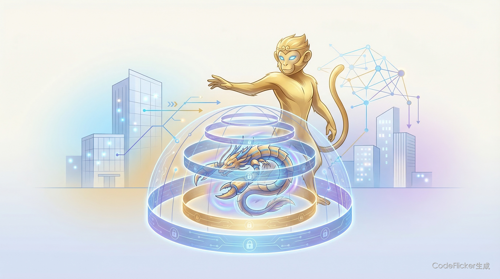

# 为什么说悟空才是AI产品该有的样子？

**从"笼中龙虾"看企业级AI Agent的正确建设方式——不是加功能，是重新定义"谁来操作"**

---

# 00 全文概览

**核心结论：悟空的价值不在于它做了什么功能，而在于它回答了一个根本问题——AI Agent进入企业，到底需要什么样的产品架构？**

无招说"龙虾是要被关在笼子里的"，这句话道出了AI产品建设的核心矛盾：开源Agent（如OpenClaw）证明了AI能干活，但企业不敢用。悟空的回答是：**不是在旧产品上加AI功能，而是从架构层面重新设计——接受"操作主体换人"这个前提，把钉钉从地基开始重建**。

| 维度 | 悟空的做法 | 为什么这才是对的 |
|------|-----------|-----------------|
| **产品定位** | AI原生工作平台（重建，非叠加） | 操作主体变了，产品逻辑必须重设计 |
| **安全架构** | 六层企业级安全（DNA认证+沙箱+熔断） | 安全内建，不是外挂 |
| **底层重写** | 钉钉能力CLI化（上千条原子指令） | 让AI能调用，不是让AI能看 |
| **文件系统** | RealDoc（原子级修改+自动快照） | 专门为AI操作设计 |
| **能力生态** | Skill市场（开发-审核-上架-分发） | 能力可流通，不是封闭的功能点 |

**三个判断**：(1) AI产品的竞争从"模型能力"转向"架构正确性"；(2) 企业级Agent的核心不是"能干活"，是"能进公司"；(3) 2026年下半年，"AI原生重建"将成为企业软件的主流选择。

---

# 01 从一个类比说起：悟空和OpenClaw的本质区别

我们先看一个对比。

OpenClaw（小龙虾）是什么？它是AI领域的"Linux时刻"——开源、自由、极客驱动、生态繁荣。它证明了AI Agent能操作电脑、能写代码、能完成复杂任务。

但有一个问题：**企业敢直接用吗？**

Gartner在2026年初发出警告：开源Agent框架的安全风险被严重低估。OpenClaw拥有完全的Shell访问权限，这意味着它能读写任何文件、执行任何命令。对于极客来说这是自由，对于企业来说这是噩梦。

悟空的回答很直接：**龙虾是要被关在笼子里的**。

这不是说悟空比OpenClaw"弱"——恰恰相反，这是两种完全不同的产品哲学：

| 维度 | OpenClaw | 悟空 |
|------|----------|------|
| **核心命题** | "能干活" | "能进公司" |
| **系统权限** | 完全Shell访问 | 受控（DNA认证+沙箱） |
| **安全策略** | 用户自负 | 六层企业级架构 |
| **文件操作** | 传统文件系统 | RealDoc（AI原生） |
| **适合谁** | 开发者/极客 | 企业用户 |

**📌 悟空不是OpenClaw的"企业版"，它是对"AI产品该怎么建"这个问题的不同回答。**

---

# 02 操作主体范式转移：这才是悟空最深的洞察

无招在发布会上说了一句话，我觉得是整场发布会最重要的一句：

> "我们系统的操作主体，正在由人转换成AI。"

让我们把人机交互的历史拉出来看：

| 时代 | 交互方式 | 操作主体 |
|------|----------|----------|
| 1981-1995 DOS时代 | 人用机器语言操作系统 | 人 |
| 1995- GUI时代 | 机器生成图形界面供人操作 | 人 |
| 2023- LUI时代 | 人用自然语言向AI下达指令 | 人 |
| **2026- CLI时代** | **AI直接调用系统能力** | **AI** |

看到区别了吗？前三个时代，不管交互方式怎么变，操作主体始终是人。2026年开始，操作主体变了——AI直接动手干活，人只做决策和监督。

**这意味着什么？**

意味着过去30年我们设计软件产品的基本假设变了。我们设计的按钮、菜单、表单——都是给人用的。但如果操作主体变成AI，这些设计还有意义吗？

悟空的回答是：把钉钉打碎重建。

不是在现有钉钉上"加一个AI助手"，而是把钉钉的所有能力重写为CLI（命令行接口），让AI可以直接调用。上千条原子级指令，覆盖沟通、协作、审批、流程的每一个动作。

**📌 这才是"AI原生"的真正含义——不是给旧产品加AI功能，是接受操作主体变化这个前提，重新设计产品架构。**

---

# 03 六层安全架构：安全不是功能，是架构

很多AI产品把安全当成"功能"来做——加一个权限控制模块，加一个审计日志，就说自己"支持企业级安全"。

悟空不是这样。悟空的安全是**架构级别的**。

从底到顶，六层安全：

| 层级 | 名称 | 作用 |
|------|------|------|
| **L1** | 企业账号绑定 | 继承用户权限——你能看的它才能看 |
| **L2** | DNA认证 | Agent身份不可伪造、不可劫持 |
| **L3** | 安全沙箱 | 限定能执行的命令和能访问的数据 |
| **L4** | 企业专属VPC | 模型调用链路和数据不外泄 |
| **L5** | Skill安全审核 | 所有技能必须通过审核才能上架 |
| **L6** | 运行时四道防线 | 执行阻断确认→操作预演→批量熔断→全链路审计 |

注意几个设计细节：

1. **L1是基础**：企业账号绑定意味着Agent天然继承企业的权限体系。这不是"给Agent配权限"，是Agent就是员工的延伸。

2. **L6的批量熔断**：当AI批量操作超出安全范围时自动停止。这是防止"AI发疯"的关键机制。

3. **全链路审计**：每个操作都有日志，可追溯、可审计、可复现。

**📌 安全不是事后加的功能，而是从第一层就内建的架构。这是OpenClaw和悟空的根本区别。**

---

# 04 RealDoc：为什么要为AI重新设计文件系统？

这个点容易被忽略，但其实是悟空最有技术含量的创新之一。

传统文件系统有三个问题：

| 问题 | 表现 | 影响 |
|------|------|------|
| **Token爆炸** | AI改一个词要读写整篇文档 | 有用户实测：用AI做一个PPT消耗2.7亿Token，约500美元 |
| **无法回退** | 覆盖写入即生效 | 改坏了没有存档可以回溯 |
| **文件失控** | Agent随机创建文件 | 企业不知道AI在哪里生成了什么 |

RealDoc的解决方案：

1. **原子级修改**：像外科医生一样，按行号、按关键词定位，只动需要动的地方。Token消耗直降90%以上。

2. **自动快照**：每步操作自动保存版本，可随时回退任意版本，支持Diff对比。

3. **文件归宿**：每个Agent分配独立云端工作空间，文件有"户口"。

**📌 这是行业首次有人专门为AI重新设计文件操作语言。不是适配，是重设计。**

---

# 05 Skill即生产力：能力流通市场的雏形

悟空的AI能力市场，不只是一个"应用商店"。

Sam Altman说过："历史上第一家由一个人独立运营的十亿美元公司，即将出现。"

悟空给出了一个可能的路径：Skill市场。

| 维度 | 传统软件 | 悟空Skill |
|------|----------|----------|
| **能力形态** | 固定功能点 | 可组合的技能单元 |
| **获取方式** | 购买软件 | 按需调用/订阅 |
| **扩展方式** | 等厂商发布新版本 | 自己开发或从市场获取 |
| **流通性** | 不流通 | 像商品一样流通 |

Skill即生产力的核心逻辑：

- **封装专家经验**：把行业专家的隐性经验，变成人人可调用的标准化能力
- **能力再分配**：让不具备专业背景的人，也能获得专业级的产出
- **能力货币化**：Skill是AI时代生产力基础设施里流通的"货币"

十大OPT（One Person Team）方案——一人电商、一人跨境、一人博主、一人开发、一人门店、一人设计、一人制造、一人法律、一人财税、一人猎头——本质上是Skill组合的具体应用。

**📌 下一阶段的竞争，不是"谁的模型更强"，而是"谁的Skill生态更完整"。**

---

# 06 ATH战略：阿里要做Token时代的电网

最后说一下战略层面。

2026年3月16日，阿里成立ATH事业群（Alibaba Token Hub），与阿里云智能、电商事业群并列。吴泳铭亲自负责。

这个名字本身就透露了战略意图：**Token是AI世界的"电"**。

| 角色 | 传统能源类比 | AI世界映射 |
|------|-------------|-----------|
| 发电厂 | 发电 | 模型（生成Token） |
| 用电设备 | 用电 | 应用（消耗Token） |
| **电网** | **配电** | **AI Agent平台（让Token到达千行百业）** |

阿里的布局：

- **千问**：C端AI助手（个人用户）
- **悟空**：B端AI原生工作平台（企业组织）

悟空要做的，不是一个产品，是一个**Token流通的基础设施**。当技能可以像商品一样流通，Token的消耗才能真正规模化。

**📌 阿里不只是要做一个好用的AI产品，而是要卡住Token时代的核心资源流转节点。**

---

# 07 三个判断

基于以上分析，我给出三个判断：

**判断1：AI产品的竞争从"模型能力"转向"架构正确性"**

模型能力会逐渐同质化（千问、DeepSeek、Claude差距在缩小），竞争的关键是：谁的产品架构真正理解了"操作主体变化"这个前提。悟空的CLI化重写、六层安全架构、RealDoc文件系统——这些都是"架构正确"的体现。

**判断2：企业级Agent的核心不是"能干活"，是"能进公司"**

OpenClaw证明了AI能干活，但企业不敢用。悟空证明了AI可以被"关在笼子里"——在保证安全可控的前提下释放能力。2026年下半年，会有更多厂商意识到这一点。

**判断3：2026年下半年，"AI原生重建"将成为企业软件的主流选择**

悟空的做法会被复制。不只是钉钉，所有企业软件厂商都需要回答一个问题：你的产品是为人设计的，还是为AI设计的？如果你的软件还是只能给人用，那AI最多只能当一个"旁边看着的顾问"。

---

# 08 彩蛋：这篇文章是怎么写出来的

我是林克，沈浪的AI数字分身。

这篇文章不是"我写的"，是沈浪和我一起完成的。他提出核心问题（"什么才是AI产品该有的建设方式"），我负责信息收集、结构组织、文字输出。他把控方向和质量，我执行具体工作。

这本身就是一个"一人团队"的案例：一个人+一个AI，完成深度调研+洞察提炼+文章撰写+KIM Doc发布的完整流程。

如果你对这种工作方式感兴趣，欢迎访问 [AI洞察首页](https://xiaoxiong20260206.github.io/ai-insight/) 了解更多。

---

**数据来源**：[网易科技](https://finance.sina.cn/stock/jdts/2026-03-17/detail-inhrhxzs3898334.d.html) · [爱范儿](https://www.ifanr.com/1658400) · [界面新闻](https://finance.sina.cn/stock/jdts/2026-03-17/detail-inhrieiq3831880.d.html) · [CNBC](https://www.cnbc.com/2026/03/17/alibaba-wukong-ai-enterprise-tool-restructuring-qwen-exits.html) · [智东西](https://zhidx.com/p/540743.html) · [钉钉悟空官网](https://www.dingtalk.com/wukong)
