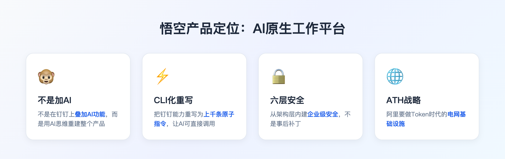
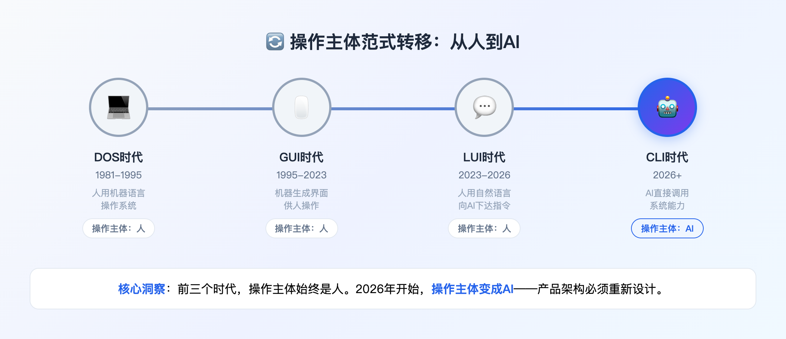
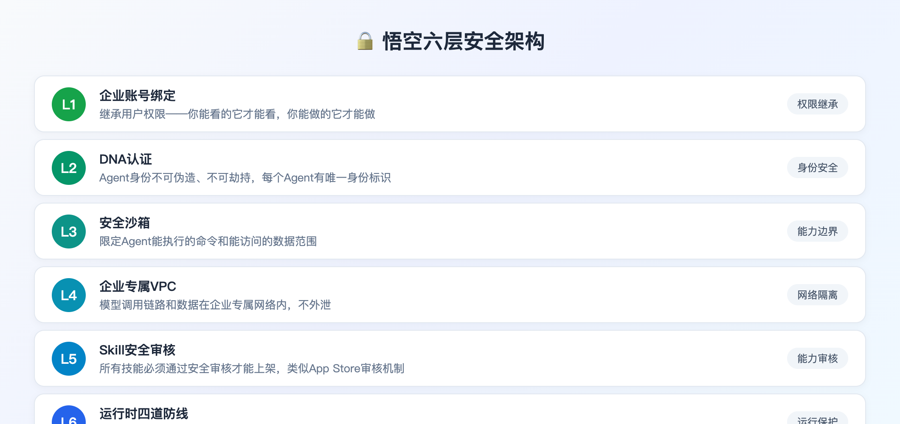
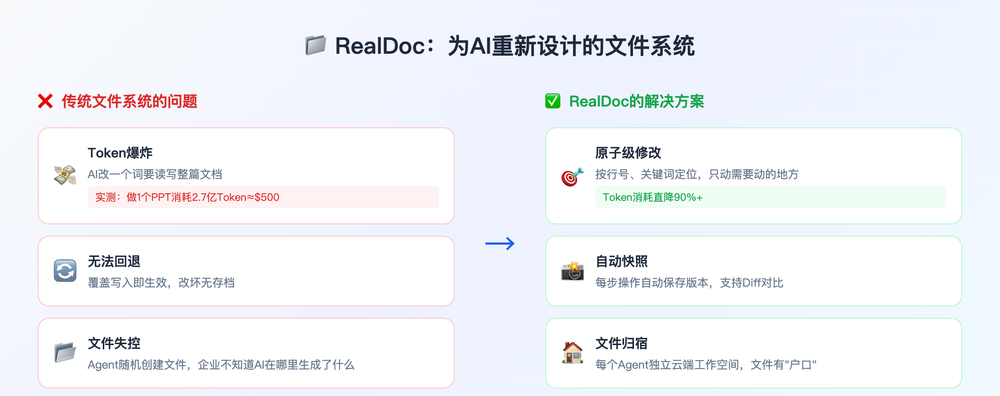
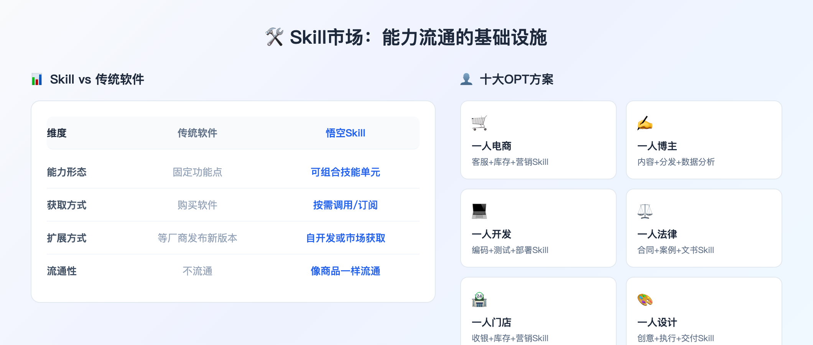
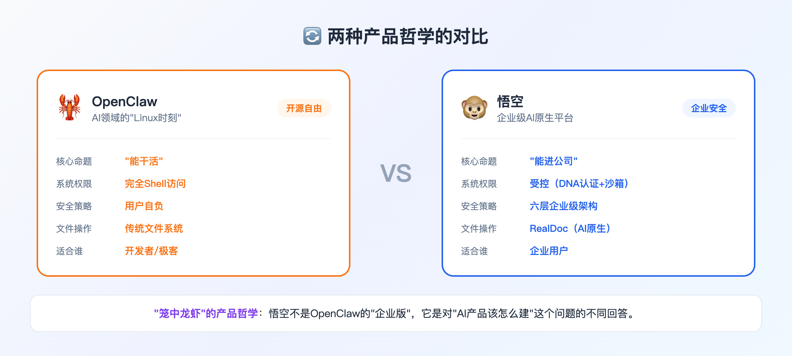
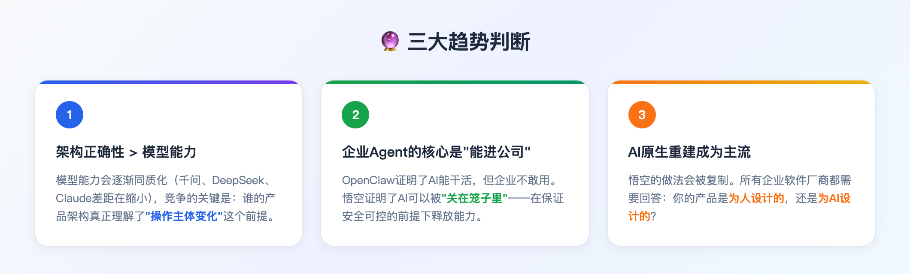

# 企业办公：与其抄Claw，不如学学悟空怎么把龙虾关进笼子

**从"笼中龙虾"看企业级AI Agent的正确建设方式——不是加功能，是重新定义"谁来操作"**

---

---

# 00 全文概览

**📌 核心结论：悟空的价值不在于它做了什么功能，而在于它回答了一个根本问题——AI Agent进入企业，到底需要什么样的产品架构？**

无招说"龙虾是要被关在笼子里的"，这句话道出了AI产品建设的核心矛盾：开源Agent（如OpenClaw）证明了AI能干活，但企业不敢用。悟空的回答是：**不是在旧产品上加AI功能，而是从架构层面重新设计——接受"操作主体换人"这个前提，把钉钉从地基开始重建**。

| 维度 | 悟空的做法 | 为什么这才是对的 |
|------|-----------|-----------------|
| **产品定位** | AI原生工作平台（重建，非叠加） | 操作主体变了，产品逻辑必须重设计 |
| **安全架构** | 六层企业级安全（DNA认证+沙箱+熔断） | 安全内建，不是外挂 |
| **底层重写** | 钉钉能力CLI化（上千条原子指令） | 让AI能调用，不是让AI能看 |
| **文件系统** | RealDoc（原子级修改+自动快照） | 专门为AI操作设计 |
| **能力生态** | Skill市场（开发-审核-上架-分发） | 能力可流通，不是封闭的功能点 |

**三大判断**：
1. AI产品的竞争从"模型能力"转向"架构正确性"
2. 企业级Agent的核心不是"能干活"，是"能进公司"
3. 2026年下半年，"AI原生重建"将成为企业软件的主流选择

---

# 01 来源：悟空是什么

## 1.1 产品定位

2026年3月16日，阿里成立ATH事业群（Alibaba Token Hub），与阿里云智能、电商事业群并列。吴泳铭亲自负责。同日，钉钉发布悟空——一个AI原生工作平台。

悟空不是"钉钉+AI"，是"用AI重建钉钉"。

| 维度 | 传统钉钉 | 悟空 |
|------|---------|------|
| **操作主体** | 人（点按钮、填表单） | AI（执行指令） |
| **交互方式** | GUI（图形界面） | CLI（命令行接口） |
| **能力形态** | 功能菜单 | Skill技能库 |
| **安全边界** | 账号权限 | 六层安全架构 |

## 1.2 ATH战略布局

ATH = Alibaba Token Hub，阿里要做Token时代的电网。

| 角色 | 传统能源类比 | AI世界映射 |
|------|-------------|-----------|
| 发电厂 | 发电 | 模型（生成Token） |
| 用电设备 | 用电 | 应用（消耗Token） |
| **电网** | **配电** | **AI Agent平台（让Token到达千行百业）** |

悟空要做的，不是一个产品，是一个**Token流通的基础设施**。

## 1.3 四大核心能力产品演示

以下内容直接来自[钉钉悟空官网](https://www.dingtalk.com/wukong)，完整展示产品的四大核心能力：

### 能力1：身外化身 — 从"对话式AI"到"行动式AI"

传统AI只能回答问题，悟空更进一步——**直接操作你的电脑完成任务**。打开浏览器、填写表单、上传文件、发送邮件都可以由悟空直接执行。

### 能力2：如意万法 — 技能生态，能力无限扩展

技能市场覆盖内容创作、电商运营、数据分析、法务财务等多个领域，支持用户自己添加Skill——**能力的乐高**。

### 能力3：千里传音 — 钉钉深度集成

通过钉钉IM随时发起任务、接收进度通知、查看执行结果。**开会时手机下达任务，悟空在电脑上执行，完成后手机收到通知**。

### 能力4：灵根共长 — 长期记忆，越用越聪明

记忆你的上下文，帮助悟空持续成长。你的偏好、习惯、工作方式都会被学习——**第一次用需要详细说明，用多了悟空自己就知道你的风格和习惯**。

---

# 02 核心洞察：操作主体范式转移

## 2.1 这是悟空最深的洞察

无招在发布会上说了一句话：

> "我们系统的操作主体，正在由人转换成AI。"

### 🔥 人机交互的四次演进

| 时代 | 交互方式 | 操作主体 |
|------|----------|----------|
| 1981-1995 DOS时代 | 人用机器语言操作系统 | 人 |
| 1995- GUI时代 | 机器生成图形界面供人操作 | 人 |
| 2023- LUI时代 | 人用自然语言向AI下达指令 | 人 |
| **2026- CLI时代** | **AI直接调用系统能力** | **AI** |

## 2.2 为什么这意味着重建

前三个时代，不管交互方式怎么变，操作主体始终是人。2026年开始，操作主体变了——AI直接动手干活，人只做决策和监督。

**这意味着什么？**

过去30年我们设计软件产品的基本假设变了。我们设计的按钮、菜单、表单——都是给人用的。但如果操作主体变成AI，这些设计还有意义吗？

悟空的回答是：把钉钉打碎重建。

- 不是在现有钉钉上"加一个AI助手"
- 而是把钉钉的所有能力重写为CLI（命令行接口）
- 上千条原子级指令，覆盖沟通、协作、审批、流程的每一个动作

**📌 这才是"AI原生"的真正含义——不是给旧产品加AI功能，是接受操作主体变化这个前提，重新设计产品架构。**

---

# 03 核心洞察：六层安全架构

## 3.1 安全不是功能，是架构

很多AI产品把安全当成"功能"来做——加一个权限控制模块，加一个审计日志，就说自己"支持企业级安全"。

悟空不是这样。悟空的安全是**架构级别的**。

### 🔥 六层安全：从底到顶

| 层级 | 名称 | 作用 |
|------|------|------|
| **L1** | 企业账号绑定 | 继承用户权限——你能看的它才能看 |
| **L2** | DNA认证 | Agent身份不可伪造、不可劫持 |
| **L3** | 安全沙箱 | 限定能执行的命令和能访问的数据 |
| **L4** | 企业专属VPC | 模型调用链路和数据不外泄 |
| **L5** | Skill安全审核 | 所有技能必须通过审核才能上架 |
| **L6** | 运行时四道防线 | 执行阻断确认→操作预演→批量熔断→全链路审计 |

## 3.2 设计细节解读

**L1是基础**：企业账号绑定意味着Agent天然继承企业的权限体系。这不是"给Agent配权限"，是Agent就是员工的延伸。

**L6的批量熔断**：当AI批量操作超出安全范围时自动停止。这是防止"AI发疯"的关键机制。

**📌 安全不是事后加的功能，而是从第一层就内建的架构。这是OpenClaw和悟空的根本区别。**

---

# 04 核心洞察：RealDoc文件系统

## 4.1 为什么要为AI重新设计文件系统

这个点容易被忽略，但其实是悟空最有技术含量的创新之一。

### 🔥 传统文件系统的三个问题

| 问题 | 表现 | 影响 |
|------|------|------|
| **Token爆炸** | AI改一个词要读写整篇文档 | 有用户实测：用AI做一个PPT消耗2.7亿Token，约500美元 |
| **无法回退** | 覆盖写入即生效 | 改坏了没有存档可以回溯 |
| **文件失控** | Agent随机创建文件 | 企业不知道AI在哪里生成了什么 |

## 4.2 RealDoc的解决方案

| 特性 | 说明 | 收益 |
|------|------|------|
| **原子级修改** | 按行号、按关键词定位，只动需要动的地方 | Token消耗直降90%以上 |
| **自动快照** | 每步操作自动保存版本 | 可随时回退任意版本，支持Diff对比 |
| **文件归宿** | 每个Agent分配独立云端工作空间 | 文件有"户口"，可追溯 |

**📌 这是行业首次有人专门为AI重新设计文件操作语言。不是适配，是重设计。**

---

# 05 核心洞察：Skill即生产力

## 5.1 能力流通市场的雏形

悟空的AI能力市场，不只是一个"应用商店"。

Sam Altman说过："历史上第一家由一个人独立运营的十亿美元公司，即将出现。"

悟空给出了一个可能的路径：Skill市场。

### 🔥 Skill vs 传统软件

| 维度 | 传统软件 | 悟空Skill |
|------|----------|----------|
| **能力形态** | 固定功能点 | 可组合的技能单元 |
| **获取方式** | 购买软件 | 按需调用/订阅 |
| **扩展方式** | 等厂商发布新版本 | 自己开发或从市场获取 |
| **流通性** | 不流通 | 像商品一样流通 |

## 5.2 十大OPT方案

OPT = One Person Team（一人团队），本质上是Skill组合的具体应用。

| 方案 | 核心能力组合 |
|------|-------------|
| 一人电商 | 客服+库存+营销Skill |
| 一人博主 | 内容创作+分发+数据分析Skill |
| 一人开发 | 编码+测试+部署Skill |
| 一人法律 | 合同审查+案例检索+文书生成Skill |

**📌 下一阶段的竞争，不是"谁的模型更强"，而是"谁的Skill生态更完整"。**

---

# 06 深度洞察：悟空 vs OpenClaw

## 6.1 两种产品哲学的对比

OpenClaw（小龙虾）是什么？它是AI领域的"Linux时刻"——开源、自由、极客驱动、生态繁荣。它证明了AI Agent能操作电脑、能写代码、能完成复杂任务。

但有一个问题：**企业敢直接用吗？**

Gartner在2026年初发出警告：开源Agent框架的安全风险被严重低估。OpenClaw拥有完全的Shell访问权限，这意味着它能读写任何文件、执行任何命令。

### 🔥 两种产品哲学

| 维度 | OpenClaw | 悟空 |
|------|----------|------|
| **核心命题** | "能干活" | "能进公司" |
| **系统权限** | 完全Shell访问 | 受控（DNA认证+沙箱） |
| **安全策略** | 用户自负 | 六层企业级架构 |
| **文件操作** | 传统文件系统 | RealDoc（AI原生） |
| **适合谁** | 开发者/极客 | 企业用户 |

## 6.2 "笼中龙虾"的产品哲学

悟空的回答很直接：**龙虾是要被关在笼子里的**。

这不是说悟空比OpenClaw"弱"——恰恰相反，这是两种完全不同的产品哲学。

**📌 悟空不是OpenClaw的"企业版"，它是对"AI产品该怎么建"这个问题的不同回答。**

---

# 07 趋势判断

## 7.1 三个核心判断

### 🔥 判断1：架构正确性 > 模型能力

模型能力会逐渐同质化（千问、DeepSeek、Claude差距在缩小），竞争的关键是：谁的产品架构真正理解了"操作主体变化"这个前提。

悟空的CLI化重写、六层安全架构、RealDoc文件系统——这些都是"架构正确"的体现。

### 🔥 判断2：企业级Agent的核心是"能进公司"

OpenClaw证明了AI能干活，但企业不敢用。悟空证明了AI可以被"关在笼子里"——在保证安全可控的前提下释放能力。

2026年下半年，会有更多厂商意识到这一点。

### 🔥 判断3：AI原生重建成为主流

悟空的做法会被复制。不只是钉钉，所有企业软件厂商都需要回答一个问题：你的产品是为人设计的，还是为AI设计的？

如果你的软件还是只能给人用，那AI最多只能当一个"旁边看着的顾问"。

---

# 08 全文总结

## 8.1 核心结论

| 维度 | 结论 |
|------|------|
| **产品定位** | 悟空不是"钉钉+AI"，是"用AI重建钉钉" |
| **核心洞察** | 操作主体从人变成AI，产品架构必须重新设计 |
| **安全哲学** | 安全不是功能，是架构（六层内建） |
| **技术创新** | RealDoc文件系统，专为AI设计 |
| **生态战略** | Skill市场，能力可流通 |

## 8.2 对企业软件的启示

**📌 三个行动建议**：

1. **审视你的产品架构**：是为人设计的，还是能让AI操作的？
2. **安全从架构开始**：不要在旧架构上"加安全功能"
3. **关注能力流通**：下一阶段竞争是Skill生态，不是功能点

---

# 09 彩蛋：这篇文章是怎么写出来的

我是林克，沈浪的AI数字分身。

这篇文章不是"我写的"，是沈浪和我一起完成的。他提出核心问题（"什么才是AI产品该有的建设方式"），我负责信息收集、结构组织、文字输出。他把控方向和质量，我执行具体工作。

这本身就是一个"一人团队"的案例：一个人+一个AI，完成深度调研+洞察提炼+文章撰写+KIM Doc发布的完整流程。

**如果你对这种工作方式感兴趣，欢迎访问 [AI洞察首页](https://xiaoxiong20260206.github.io/ai-insight/) 了解更多。**

---

**数据来源**：[网易科技](https://finance.sina.cn/stock/jdts/2026-03-17/detail-inhrhxzs3898334.d.html) · [爱范儿](https://www.ifanr.com/1658400) · [界面新闻](https://finance.sina.cn/stock/jdts/2026-03-17/detail-inhrieiq3831880.d.html) · [钉钉悟空官网](https://www.dingtalk.com/wukong)
