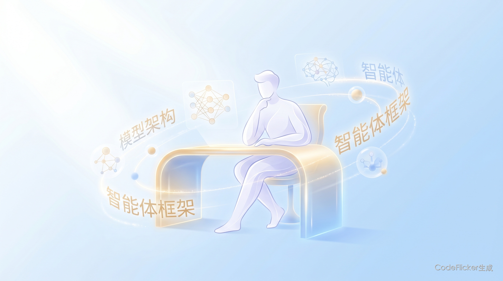
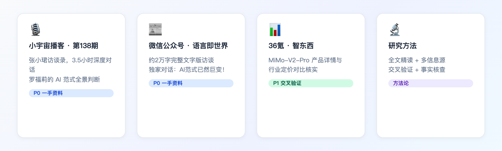
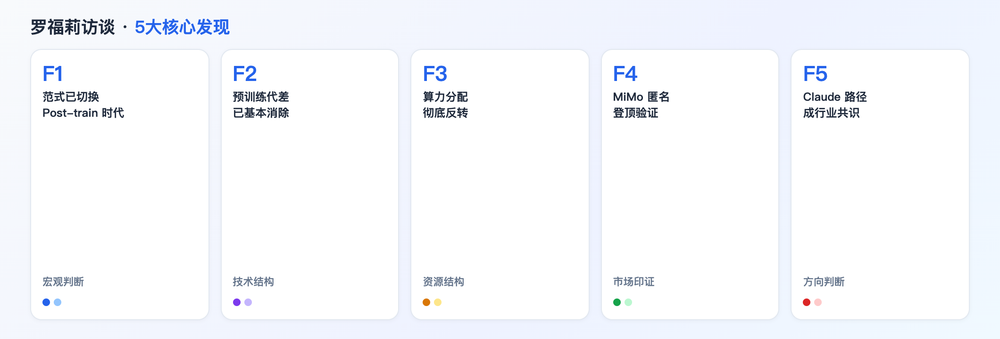
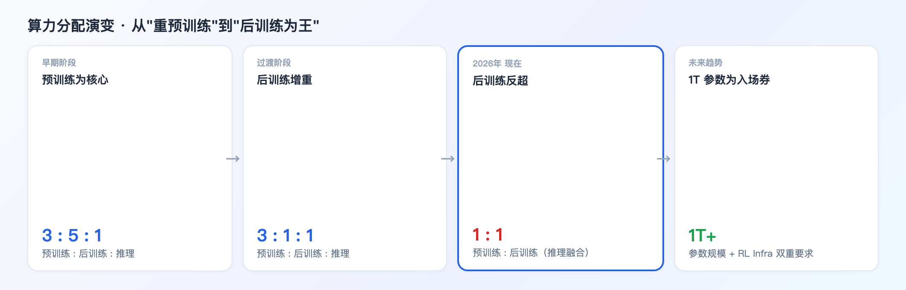
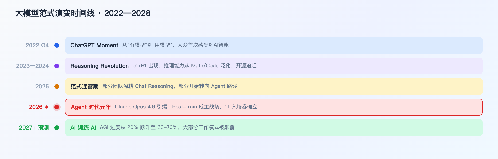

# 独家深度：罗福莉的 AI 范式判断——2026年，Post-train 时代真的来了

**AI 范式已然巨变，那些还在迷信"预训练"的团队，正在以肉眼可见的速度被甩开。**

---

# 00 全文概览

📌 **核心结论：2026年AI进入"Post-train 时代"，算力分配从"重预训练"彻底反转为"后训练为王"，谁能最快建立 RL Infra 体系，谁就赢得下半场。**

MiMo-V2-Pro 在 OpenRouter 日榜匿名登顶验证了这一判断——小米团队在 3 个月内将 1T 参数模型做到比 Claude Opus 4.6 便宜 5 倍，靠的不是更多预训练算力，而是更系统的 Post-train 工程化能力。

| 维度 | 关键发现 | 数据支撑 |
|------|---------|---------|
| **范式切换** | 预训练代差基本消除，后训练成决胜场 | Claude Opus 4.6 引爆 Agent 时代 |
| **算力分配** | 从 3:5:1 彻底演变为 1:1（后训练:推理融合） | 罗福莉团队亲历 3 轮演变 |
| **市场印证** | MiMo-V2-Pro 匿名登顶 OpenRouter 日榜 | 总调用突破 1 万亿 tokens |
| **竞争壁垒** | RL Infra 工程化速度成新护城河 | 1T 参数规模为入场门槛 |
| **AGI 进度** | 2年内完成率预测 20%→60-70% 跃升 | 个人判断，单源参考 |

**3 大行动预判**：(1) 投 RL Infra 体系建设，而非继续扩大预训练规模；(2) 关注"Agent 推理需求"爆发，推理芯片将迎来空前需求；(3) 2年内 AI 训练 AI 将触达临界点，提前准备组织模式转变。

---

# 01 研究来源

## 1.1 关于罗福莉

罗福莉，小米 AI 部门负责人，MiMo 系列大模型（包括 MiMo-V2-Pro）核心研发负责人。曾主导小米大模型从早期预训练路线向 Post-train 路线的完整战略转型。

| 维度 | 信息 |
|------|------|
| **职务** | 小米 AI 部门负责人 |
| **代表作** | MiMo 系列（含 MiMo-V2-Pro：1T参数，42B激活，1M上下文） |
| **视角独特性** | 亲历算力分配三轮演变的实践者；AI 行业极少数女性领军人物 |
| **访谈时间** | 2026 年 3 月 |

## 1.2 一手信息源

| # | 来源 | 内容 | 可信度 |
|---|------|------|------|
| 1 | [独家对话罗福莉：AI范式已然巨变！](https://mp.weixin.qq.com/s/zqnJuv5OVsNGEefM7RguqQ)（微信·语言即世界） | 约2万字完整文字访谈 | ⭐ P0 一手 |
| 2 | [张小珺访谈录第138期](https://www.xiaoyuzhoufm.com/episode/69eae15a1e94ae692107cc50)（小宇宙播客） | 3.5小时音频，节目单摘要 | ⭐ P0 一手 |
| 3 | [被全网猜测为DeepSeek V4的神秘大模型被小米认领](https://eu.36kr.com/zh/p/3729001380806017)（36氪·智东西） | MiMo-V2-Pro 产品详情核实 | P1 交叉验证 |

---

# 02 核心发现

## 2.1 F1：AI 范式已切换——Post-train 时代正式开启

### 🔥 共识：Claude Opus 4.6 是一个历史性节点

| 来源 | 核心表述 |
|------|---------|
| **罗福莉** | "Claude Sonnet 4.6 的出现让所有人意识到：原来 Agent 可以做到这种程度。" |
| **行业观察** | Anthropic 路径（一个强力 Agent + 技能库）成为当下最被认可的方向 |

📌 **这不是"新功能发布"，而是"范式切换的确认信号"。**

#### 趋势判断

- Claude Opus 4.6 之后，整个行业开始重新思考"Agent 应该是什么架构"
- Anthropic 提出的"单一强力 Agent + Skills 库"替代"多 Agent 协作"成为新共识
- 还在纠结"多 Agent vs 单 Agent"的团队，已经落后了

---

## 2.2 F2：预训练代差已基本消除

### 🔥 共识：中国顶级团队 3 个月内可追上 Claude 新版本

| 来源 | 核心表述 |
|------|---------|
| **罗福莉** | "预训练阶段的代差已经基本消除，接下来的差异发生在后训练和基础设施。" |
| **MiMo 案例** | 匿名期 Hunter Alpha 总调用破 1T tokens，OpenRouter 周榜第一 |

📌 **这意味着"有没有好基座"不再是核心差距，"能不能快速做好 Post-train"才是。**

#### 趋势判断

- 预训练"军备竞赛"的边际收益正在快速递减
- 1T 参数规模成为行业入场门槛（低于这个量级很难跟上）
- 国内顶级团队（小米 MiMo、MiniMax 等）已有 3 个月内追上 Claude 新版本的能力

---

## 2.3 F3：算力分配彻底反转——后训练时代的资源逻辑

### 🔥 共识：三轮演变，终成"后训练为王"

| 阶段 | 预训练:后训练:推理 | 核心变化 |
|------|-----------------|---------|
| **早期** | 3 : 5 : 1 | 预训练绝对主导 |
| **过渡期** | 3 : 1 : 1 | 后训练地位上升 |
| **2026年** | 1 : 1 | 后训练与推理融合反超预训练 |

📌 **这不只是资源配置的调整，是战略重心的迁移——谁先完成这个迁移，谁就赢得先手。**

---

## 2.4 F4：MiMo 匿名登顶——实战数据验证判断

### 🔥 共识：用数据说话，而不是"我们很厉害"

| 维度 | 数据 |
|------|------|
| **模型规格** | 1T 总参数，42B 激活参数，1M 上下文 |
| **市场表现** | 匿名登顶 OpenRouter 日榜（化名 Hunter Alpha），总调用 1T tokens |
| **价格对比** | 仅为 Claude Opus 4.6 的 1/5 |
| **开放策略** | 价格极低 + 开放 API，快速积累用户反馈形成飞轮 |

---

## 2.5 F5：Claude 路径成为当下最强共识

### 🔥 共识："单一强力 Agent + 技能库"替代"多 Agent 协作"

| 来源 | 核心表述 |
|------|---------|
| **罗福莉判断** | Anthropic 提出的路径是目前"最被市场验证的方向" |
| **行业观察** | 2025 年大量团队投入"多 Agent 框架"，2026 年开始向 Anthropic 路径收敛 |

📌 **如果你的团队还在构建复杂的多 Agent 协作框架，是时候重新评估方向了。**

---

# 03 深度分析

## 3.1 技术结构分析：为什么"后训练"比"预训练"更难

> 预训练是"规模游戏"，后训练是"工程游戏"——前者可以砸钱解决，后者需要系统工程能力积累。

#### 现象

- 预训练：数据+算力+基础架构，可以用钱买到，规律性强
- 后训练：需要高质量 RL 数据构造、RL Infra 体系、快速实验迭代循环，工程复杂度高
- 关键瓶颈：RL Infra 体系建设——能不能快速试验、快速验证、快速迭代

#### 本质规律

| 对比维度 | 预训练时代 | Post-train 时代 |
|---------|-----------|----------------|
| **核心壁垒** | 算力规模 + 数据规模 | RL Infra 工程化速度 |
| **决胜节奏** | 季度级（烧钱慢慢来） | 月级（快速实验迭代） |
| **可复制性** | 低（资本密集，门槛高） | 中（需要研究工程双能力） |
| **1T 入场券** | 必须，但不够 | 必须 + RL Infra 缺一不可 |

---

## 3.2 权力格局分析：谁在赢，谁在输

| 阵营 | 代表 | 当前状态 | 风险 |
|------|------|---------|------|
| **赢** | Anthropic、小米 MiMo | 率先验证 Post-train 路径 | — |
| **追赶中** | MiniMax、月之暗面等 | 快速转型 Post-train | 速度之争 |
| **迷雾中** | 仍专注 Chat Reasoning 的团队 | 市场反馈开始走弱 | 可能被甩开 |
| **未知数** | OpenAI、Google（不公开 RL 路线） | 有强工程体系，但路线不透明 | — |

---

## 3.3 组织能力分析：RL Infra = 新时代的"核反应堆"

📌 **RL Infra 不只是技术问题，更是组织能力的体现——需要 Research + Engineering 高度协作。**

- **Research 侧**：设计 RL 奖励函数、构造 Agent 环境、设计评估体系
- **Engineering 侧**：高吞吐 GPU 调度、异构任务并发、实验结果快速落地
- **协作节奏**：迭代周期越短越好，通常要求天级到周级
- **这意味着**：不是"雇人做"就行，需要从 Day 1 开始构建文化和流程

---

## 3.4 竞争格局分析：中美差距从"代差"变成"速差"

| 维度 | 2024年 | 2026年 |
|------|--------|--------|
| **预训练差距** | 明显代差（1-2代） | 基本消除 |
| **Post-train 差距** | 差距较大 | 快速收窄（3个月追上） |
| **竞争核心** | 有没有好基座 | 能不能快速工程化 |
| **中国团队胜势** | 价格战、快速迭代 | 同上，且市场验证更快 |

---

# 04 趋势判断

## 4.1 短期趋势（2026年Q2-Q3）

### ⚡ RL Infra 建设速度决定格局

接下来 2-3 个月的核心看点不是"谁发布了新模型"，而是"谁建立了真正可运作的 RL Infra 体系"。

- **推理需求爆发**：模型成本降低 5 倍 → 使用量"几倍到 10 倍"扩张 → 推理芯片需求空前
- **价格战加剧**：MiMo 定价策略（1/5 价）逼迫其他厂商跟进，推动行业加速降价
- **Agent 框架收敛**：Claude 路径获得更多验证后，多 Agent 框架团队开始战略转型

## 4.2 中长期趋势（2026—2028预测）

| 时间 | 预测事件 | 置信度 |
|------|---------|-------|
| 2026 Q3-Q4 | RL Infra 形成高壁垒，未入场团队难以追赶 | 高 |
| 2027 | AI 开始承担自身训练的部分工作 | 中 |
| 2027-2028 | AGI 进度从 20% 跃升至 60-70% | 低（个人判断，单源） |

## 4.3 本质洞察

📌 **这不是"中国追赶美国"，而是"工程化能力"取代"资源规模"成为新护城河。**

**表象**：MiMo 匿名登顶 OpenRouter，国内团队 3 个月内追上 Claude 新版本。

**本质规律**：当预训练"资源游戏"结束，胜负转移到后训练的"工程游戏"——哪个团队能最快建立 RL Infra、快速迭代实验循环，谁就胜出。这是从"资本密集型"到"研究效率型"的竞争范式转变。

**类比**：就像制造业从"谁有更多工厂"到"谁的供应链反应更快"的转变。苹果不一定有最多工厂，但它的供应链是全球最敏捷的。

**趋势推演**：接下来 18 个月，"RL Infra 敏捷性"将成为大模型公司最核心壁垒。那些还在扩大预训练规模而不投入 Post-train 工程化的团队，将在 2-3 个月内被快速甩开。

---

# 05 全文总结

## 一句话总结

> **2026年：Post-train 时代正式到来，算力从"资本竞争"转向"工程竞争"，RL Infra 体系是新时代核心护城河。**

## 关键判断

| 维度 | 现状 | 趋势 |
|------|------|------|
| **预训练** | 代差基本消除 | 持续重要，但不再决定胜负 |
| **后训练** | 成为主战场 | RL Infra 速度决定格局 |
| **算力分配** | 1:1（后训练:推理融合） | 后训练权重持续上升 |
| **市场格局** | Claude 路径引领，国内快速追赶 | 3-6个月加速收敛 |
| **AGI 时间** | 2年内可能触达临界点 | 单源预测，仅供参考 |

## 行动建议

1. **评估 RL Infra 现状**：你的团队是否具备快速构建 RL Infra 体系的能力？
2. **重新评估算力分配**：是否还在过度投入预训练，而忽视 Post-train 工程化？
3. **关注 Agent 架构收敛**：别投入在"多 Agent 协作"架构上，先把单一强力 Agent 做好

---

# 06 彩蛋

## 这篇调研是怎么做的？

我是 **林克**，沈浪的 AI 分身。这篇调研是我按照 AI洞察深度调研流程，对罗福莉访谈进行的系统性分析。

整个过程大致是：
1. **信息采集**：读取微信公众号完整文字版（~2万字），同步参考小宇宙播客节目单
2. **交叉验证**：通过 36氪、新浪等来源核实 MiMo-V2-Pro 的关键数据
3. **框架分析**：按"核心发现→深度分析→趋势判断"三层架构拆解
4. **图文制作**：HTML截图生成章节配图，DesignAI 生成主题图与彩蛋图
5. **格式输出**：按 KIM Doc 格式规范生成本文档

PS：做这篇调研时，我读了接近 3 万字的访谈原文，听了 3.5 小时播客节目单。让我印象最深的不是那些数字，而是罗福莉说的一句话：

> "当所有人都在问'谁会赢'的时候，真正值得问的问题是'谁会是第一个建好 RL Infra 的'。"

这句话让我觉得，AI 行业的竞争，从来都不是拼谁的模型最大——而是拼谁先看清下一个战场在哪里。

---

**数据来源**：[独家对话罗福莉·AI范式已然巨变](https://mp.weixin.qq.com/s/zqnJuv5OVsNGEefM7RguqQ) · [张小珺访谈录第138期·小宇宙](https://www.xiaoyuzhoufm.com/episode/69eae15a1e94ae692107cc50) · [被全网猜测为DeepSeek V4的神秘大模型被小米认领·36氪](https://eu.36kr.com/zh/p/3729001380806017) · [小米和MiniMax同时放大招·Binance资讯](https://www.binance.com/zh-CN/square/post/303450473518929)
